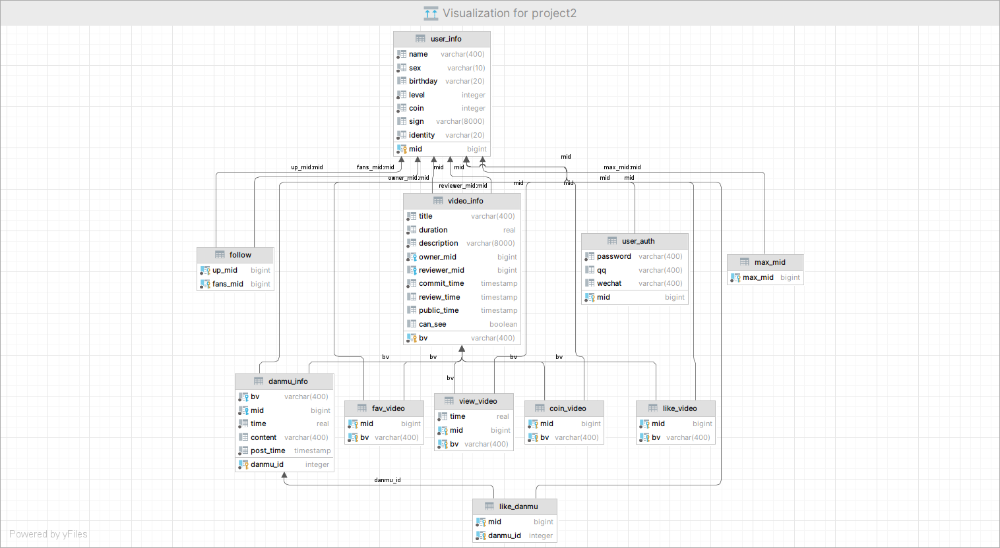

# CS307 Project Part II


## Basic Information

| Member | Student ID | Contribution Rate |
| ------ | ---------- | ----------------- |
| 袁龙   | 12211308   | 33.33%            |
| 于斯瑶 | 12211655   | 33.33%            |
| 赵钊   | 12110120   | 33.33%            |

**Contribution of work** 
袁龙: E-R diagram, UserService and DanmuSercive implementation  
于斯瑶: RecommenderService and DatabaseSercive implementation, password encryption 
赵钊: Database Design, Table Creation, VideoService implementation, BV algorithm


## Database Design

### 1. E-R Diagram


### 2.  Database Diagram by DataGrip




### 3. Table Design Description

We design **11** tables for this project, **10** of them are basic tables and others are help tables to increase efficiency. A brief description of each table is as follows.

**The 10 tables as below are basic tables.**

**user_info**: contains 8 columns of basic information of a user

**user_auth**: contains 4 columns of authentic information of a user

**follow**:  `up_mid` and `fans_mid` is the mid of follower and followee

**video_info**: contains 10 basic columns (including `bv`, `title`, `duration`, `description`, `owner_mid`, `reviewer_mid`, `commit_time`, `review_time`, `public_time`) of information of a video

**like_video**: 2 columns `mid` and `bv` is the mid and bv of the user and the video be liked, also has a constraint `primary key (bv, mid)`

**coin_video**, **fav_video** and **view_video** is the same as **like_video**, but **view_video** contains an extra column `time`, which records where did the user watch in the video

**danmu_info**:  has a self increasing primary key `danmu_id`, and other 5 columns (including `bv`, `mid`, `time`, `content` and `post_time`) of basic information of a danmu

**like_danmu**: records a user (with mid `mid`) liked a danmu (with id `danmu_id`)

**The 1 table as below are help tables mentioned above.**

**max_id**: records the max value of `mid` exists now, in order to increase the efficiency of register a new user (we only need to use (`max_mid` + 1) to be the new user's mid)


### 4. Database Privilege

The user has been used in this project is called `manager`, and the database we used in this project is called `project2`. The user `manager` has privilege to access to all tables and do select, insert, update, delete and truncate operations of schema `public` in database `project2`. Here are the sql statement to create user `manager`:

```sql
create user manager with password '123456';
grant connect on database project2 to manager;
grant usage on schema public to manager;
grant select, insert, update, delete, truncate on all tables in schema public to manager;
```


## Basic API Specification

At first, we create a class called `Authenticaiton` and there exists a static method call `authentication(AuthInfo auth, DataSource datasource)` to verify if the user's authentic information can login or not.

### DatabaseServiceImpl.java

There are 3 methods to implement in this interface.

``` java
public List<Integer> getGroupMembers() 
```

This method returns a list contain group members' student ID.

```java
public void importData(
    List<DanmuRecord> danmuRecords,
    List<UserRecord> userRecords,
    List<VideoRecord> videoRecords
) 
```

This method inserts data through batch processing.

The set value is 1000, and the quantity of each batch can be modified by the variable``public static int BATCH_SIZE``. 

In the subsequent report, we optimized this insertion by using multi-threading, and the decision to use faster insertion can be determined by the variable ``public static boolean USE_FASTER_IMPORT``.

```java
public void truncate() 
```

This method truncates all tables.

### UserServiceImpl.java

There are 4 methods to implement in this interface. 

```java
long register(RegisterUserReq req);
```

Firstly, check whether the `RegisterUserReq` is valid. if not, return -1.  

If the check is passed, query the max_mid in `max_mid,` and use it add 1 to generate the mid of the new user. Then insert the information into `user_info` and `user_auth` successively. Meanwhile, update the max_mid in `max_mid`.

```java
boolean deleteAccount(AuthInfo auth, long mid);
```

First verify if the `AuthInfo` is valid or not. If not, return false.  

Then search if there exists the user relating to the mid. If not, return false.

If both the user that initiated the command and the deleted user are the same or the identity of initiator is `superuser` as well as the deleted user is just `user`, it will be deleted successfully. 

```java
boolean follow(AuthInfo auth, long followeeMid);
```

First verify if the `AuthInfo` is valid or not. If not, return false.

Then search if there exists the user relating to the ``followeeMid``. If not, return false.

If the user has followed the followeemid when performing this operation, it will be deleted from `follow`. On the contrary, it will be inserted.

```java
UserInfoResp getUserInfo(long mid);
```

Firstly, search if there exists the user relating to the mid. If not, return null.

Then use sql query statements to obtain the information and return all needed information.  
### VideoServiceImpl.java

There are 10 methods to implement in this interface.

```java
String postVideo(AuthInfo auth, PostVideoReq req);
```

First verify if the `AuthInfo` is valid or not. If not, return null.

Then check whether the `PostVideoReq` is valid. If not, return null.

If the check are passed, then generate a unique bv for the video and insert data into table `video_info` of  database `project2`. **We have an efficient algorithm (which is detailed explained in Implement Optimize) to generate bv and we ensure that all bv are unique.**

```java
boolean deleteVideo(AuthInfo auth, String bv);
```

First verify if the `AuthInfo` is valid or not. If not, return false.

Then search if there exists the video relating to bv. If not, return false.

If the user is the owner of the video or the user's identity is superuser, then delete the video from table `video_info` of  database `project2` and return true. 

```java
boolean updateVideoInfo(AuthInfo auth, String bv, PostVideoReq req);
```

First verify if the `AuthInfo` and `PostVideoReq` is valid or not. If not, return false.

Then search if there exists the video relating to bv. If not, return false.

If all the check are passed, update the information of video in table `video_info` and return true.

```java
List<String> searchVideo(AuthInfo auth, String keywords, int pageSize, int pageNum);
```

First verify if the `AuthInfo` is valid or not. If not, return null.

Then search if there exists the video relating to bv. If not, return null.

**It is worth noting that ``keywords`` may contain symbols such as ``\``,``%`` which will work in the expression, and we need to replace them with themselves but beginning with``\``.**

```java
String[] word = (words[i] + "!").split("%");
words[i] = word[0];
for (int j = 1; j < word.length; j++) words[i] = words[i] + "\\%" + word[j];
words[i] = words[i].substring(0, words[i].length() - 1);
```

Use two `HashMap` to record the count of matched keywords and count of view of each video. Sort them according to the sorting rule and return the list.

```java
double getAverageViewRate(String bv);
```

First search if there exists the video relating to bv. If not, return -1.

Then calculate every view rate of the view and calculate the average of them then return.

```java
Set<Integer> getHotspot(String bv);
```

First, check for the corner cases. If happened, return empty set.

Then search each danmu of this video and record which spot it belongs.

At last, get which hotspots has the max number of danmu and return.

```java
boolean reviewVideo(AuthInfo auth, String bv);
```

If corner cases happened, false will returned.

If all the check passed, the video will be marked as reviewed through change  column `can_see` to true. And the columns `reviewer_mid` and `review_time` will be update.

```java
boolean coinVideo(AuthInfo auth, String bv);
boolean likeVideo(AuthInfo auth, String bv);
boolean collectVideo(AuthInfo auth, String bv);
```

**These 3 methods are almost same.** But `coinVideo(AuthInfo auth, String bv)` need to check and update the number of coin.

If corner cases happened, return false.

If all the checks passed, a new record will be insert into `coin_video` or `like_video` or `fav_video`.

### DanmuServiceImpl.java

There are 3 methods to implement in this interface.

```java
long sendDanmu(AuthInfo auth, String bv, String content, float time);
```

If any corner cases happened, return -1.

If all the checks passed, insert all the information into `danmu_info` and return the new danmu_id.

```java
List<Long> displayDanmu(String bv, float timeStart, float timeEnd, boolean filter);
```

If any corner cases happened, return null.

If all the checks passed, judge whether it's filter. If not, just display all danmu in this video between the given time. On the contrary, use sql statement to filter out the same danmu while retaining the earliest. 

```java
boolean likeDanmu(AuthInfo auth, long id);
```

First verify if the `AuthInfo` is valid or not. If not, return false.

Then search whether the id exists and whether the user watched the video where the danmu is. If not, return false.  

If the user has liked the danmu when performing this operation, it will be deleted from `like_danmu`. On the contrary, it will be inserted.


### RecommenderServiceImpl.java

There are 3 methods to implement in this interface.

```JAVA
public List<String> recommendNextVideo(String bv) 
```

This method recommends five videos based on the common viewers of the current video and other videos.

First, we check if the input is valid. If the video does not exist in the visible videos, return null. 

Then, we use SQL to find videos that have common viewers with it, sort them, and return the top five.

```java
public List<String> generalRecommendations(int pageSize, int pageNum)
```

This method recommends videos based on video scores.

First, we check if the input is valid. If not, return null.

Then we use SQL to query the scores of each video, specifically querying the ratio of likes, coins, favorites, sending danmu, and average completion. Then we add them together. 

**It is worth noting that there are many data points where the video has not been watched but has received likes, etc.,  we limit it to 1 if so.** 

Last, we  return the required videos' bv as a ``list``.

```java
public List<String> recommendVideosForUser(AuthInfo auth, int pageSize, int pageNum)
```

This method is based on interests, specifically the videos watched by friends, to recommend videos.

First, we check if the input is valid. If not, return null.

Next, we use SQL queries to check if the user has any friends. If they don't, we call ``generalRecommendations(int pageSize, int pageNum)``.

Then, we use SQL queries to find videos that at least one friend has watched, and then we sort them to return the required videos' bv as a ``list``.

```java
public List<Long> recommendFriends(AuthInfo auth, int pageSize, int pageNum) 
```

This method recommends other users to a specific user based on their mutual following with the user's friends.

First, we check if the input is valid. If not, return null.

Then, we use SQL to find the users who followed same users with this user, but are not followed by this user. The users are then sorted and returned as a ``list`` of mid.


## Implement Optimize

### 1. Optimization of Import Data

We use multi-thread to improve the efficiency of import data. **Found that the number of follow, like a video, coin a video, collect a video, view a video, like a danmu is very large**, so in the tables related to these, we use multi-thread improve.

Take insert into table `follow` as an example. The method `insertInFollow(List<UserRecord> userRecords)` below is the method deal with it.

```java
private void insertInFollow(List<UserRecord> userRecords) {
    int nThread = Math.min((int) Math.sqrt(userRecords.size()), 8);
    ExecutorService executorService = Executors.newFixedThreadPool(nThread);
    try {
        int dealData = 0;
        int ONE_THREAD_DEAL = userRecords.size() / nThread + 1;
        int threads = 0;
        List<UserRecord> users = new ArrayList<>();
        // ---- divide the data into 8 threads ----
        for (int k = 0; k < userRecords.size(); k++) {
            users.add(userRecords.get(k));
            dealData++;
            if (dealData % ONE_THREAD_DEAL == 0) {
                CThread c = new CThread(users);
                executorService.execute(c);
                users = new ArrayList<>();
            }
        }
        CThread c = new CThread(users);
        executorService.execute(c);
        executorService.shutdown();
        try {
            executorService.awaitTermination(10, TimeUnit.MINUTES);
        } catch (InterruptedException e) {
            e.printStackTrace();
        }
    } catch (Exception e) {
        e.printStackTrace();
        executorService.shutdown();
    }
}
```

Because the provided DataSource with annotation `@Autowired` is HikariDataSource. **Its maximum connection is 8, so we use 8 threads to insert record. ** We use ExecutorService to manage our threads instead of manage it manually. The class `CThread` extended `Thread` and its method `run()` controls JDBC to insert data into the tables of database.

After divide data into 8 threads, the thread pool execute and shutdown. In order to block the main thread, we add a method `awaitTermination(10, TimeUnit.MINUTES)`. **If we do not block the main thread, the main thread will continue and other connection will be applied and this will cause exception.** 

We test the time cost of import data before optimize and after optimize **each for 5 times**, the result is as follow. **The efficiency is improved about 221%.**

| Test No.        | 1      | 2      | 3     | 4      | 5      | avg    |
| --------------- | ------ | ------ | ----- | ------ | ------ | ------ |
| before optimize | 14m25s | 12m54s | 13m8s | 13m39s | 14m17s | 13m41s |
| after optimize  | 7m25s  | 5m18s  | 6m3s  | 5m46s  | 6m15s  | 6m10s  |

(* The data tested is the released large data, not small data)


### 2. Optimization of Query 

After we read the project requirements at the beginning, we realized that we need to query some quantities such as the total number of likes and views. If we can maintain these quantities, then we can do the queries quickly. **So we used a trigger on ``like_video``, ``coin_video``, ``fav_video``, ``view_video``to maintain  ``like_cnt``, ``coin_cnt``, ``fav_cnt``, ``view_cnt``.** In the case of more complex queries, the time used becomes less. Here is an example of our trigger function and trigger of table `like_video`.

```sql
create or replace function likev_update() returns trigger as $$
begin
    if (TG_OP = 'INSERT') then
        update video_info set like_cnt = like_cnt + 1 where bv = new.bv;
    elsif (TG_OP = 'DELETE') then
        update video_info set like_cnt = like_cnt - 1 where bv = new.bv;
    end if;
    return null;
end;
$$ language plpgsql;

create trigger likev
after insert or delete on like_video
for each row
execute function likev_update();
```

To investigate whether using triggers is an effective optimization, we conducted tests by inserting data and calling methods in the interface `RecommenderService`. Here is the result:

| Test        | Without Trigger | With Trigger | Result                   |
| ----------- | --------------- | ------------ | ------------------------ |
| Query       | 183734 ms       | 313 ms       | Quicker about 587 times  |
| Import Data | 13 min 41 s     | > 1 h        | Slower more than 5 times |

Although the data shows that the efficiency of query operation has been greatly improved, and the efficiency of import data only slow 5 times. But the time cost of import data is originally very large, a 5 times slower cause a very big effect. Even if we execute 10 queries, the time saved compare to the time spend more in import data is still very less.

This is where we have to rethink the need for triggers.

In real projects, queries and modifications are almost very large, and the number of queries is often larger than the number of modifications, so it is economical to maintain these variables. **But just for this project, the inserts are in the millions, while the test queries are only in 1e3**. The queries are much smaller than the inserts, so maintaining preprocessed variables is very costly and the benefits are small. So we got rid of the trigger, and started to work on optimizing in other ways, that is, optimizing the sql query statement.

The following 2 queries are the DQL of method `recommendVideosForUser(AuthInfo auth, int pageSize, int pageNum)`.

```sql
-- before optimize --
select v.bv, count(*) as cnt
from view_video v
         join (select up_mid, fans_mid as friends_mid
               from follow
               where (fans_mid, up_mid) in (select up_mid, fans_mid from follow) and up_mid = ?) f 
         on f.friends_mid = v.mid
         join video_info i on v.bv = i.bv
         join user_info ui on i.owner_mid = ui.mid
where (v.bv , f.up_mid) not in (select bv, mid from view_video)
group by v.bv, ui.level, i.public_time
order by cnt desc, ui.level, i.public_time;

-- after optimize --
select v.bv, count(*) as cnt
from view_video v
         join (select up_mid, fans_mid as friends_mid
               from follow
               where (fans_mid, up_mid) in (select up_mid, fans_mid from follow) and up_mid = ?) f 
         on f.friends_mid = v.mid
         join video_info i on v.bv = i.bv
         join user_info ui on i.owner_mid = ui.mid
where (v.bv , f.up_mid) not in (select bv, mid from view_video where mid = ?)
group by v.bv, ui.level, i.public_time
order by cnt desc, ui.level, i.public_time;
```

The only changed of this 2 query is the sub-query behind `not in`. We only add `where mid = ?` this limitation, and the speed of this query has significant improvement. But the logic is very obvious, we want to filter out the video this user have watched, we only need to search the videos this user have watched and we do not need to care about other user's view record.

The following 2 queries are the DQL of calculate the like points in method `generalRecommendations(int pageSize, int pageNum)`.

```sql
-- before optimize --
select cast(count_like as float) / cast(count_view as float) as cnt
from (select bv, count(*) as count_like
      from (select mid, bv
            from like_video
            intersect
            select mid, bv
            from view_video) like_table
      group by bv) like_cnt
         join
         (select bv, count(*) as count_view from view_video group by bv) view_cnt 
         on view_cnt.bv = like_cnt.bv
where count_view <> 0
order by cnt desc;

-- after optimize --
select like_cnt.bv, cast(count_like as float) / cast(count_view as float) as cnt
from (select count(mid) as count_like, bv from like_video
	where (bv, mid) in (select bv, mid from view_video)
	group by bv) like_cnt
    join
    (select bv, count(*) as count_view from view_video group by bv) view_cnt 
    on view_cnt.bv = like_cnt.bv
where count_view <> 0
order by cnt desc;
```

We use `from like_video where (bv, mid) in (select bv, mid from view_video)` instead of `from (select mid, bv from like_video intersect select mid, bv from view_video)` and the time cost reduce from about 40 seconds to less than 3 seconds. We should avoid using `intersect` unless we have no other choice because the intersect operation is very complex and with a very high algorithm complexity. Instead, we can use nest query to make it more faster.


### 3. Password Protection

To enhance out system's security, we encryption the password then insert them into database. **If someone intrusion the database and steal all the records, he can directly know everyone's password, which is very dangerous.** So we should encryption the password then insert them into database. Then comes a problem, how should we encryption the password.

At first, we think we can use a one-to-one function (denote as *f* ), then we insert *f(password)* into database, and when we want to check `AuthInfo`, we calculate *g(password after encryption)* (*g* is the inverse function of *f*). In cryptography, this is called symmetric cryptography, which means the message sender and receiver share the same secret key for both encryption and decryption. **But this is not security enough, because the encryption process can be inverse so if someone know only one side's secret key, the password will be decipher.**

If we consider asymmetric encryption, also called public key encryption, which means the information obtained by encrypting a user's key can only be decrypted using that user's decryption key. **If one is known, the other cannot be calculated. Therefore, if one of a pair of keys is disclosed, it will not compromise the secret properties of the other.** The most widely used asymmetric encryption algorithm is RSA. But there are still some disadvantage of asymmetric encryption

Then, there comes an idea. **We can use irreversible encryption.** We assign a hash function and when the password is inserted into database, we call this hash function and insert the result after encipher. When we want to check whether the `AuthInfo` is valid or not, we call this hash function again and compare the result of the password the user gives after encipher to the account's password after encipher in the database. This is much safer than the first method.

In cryptography, the is a concept called **salt**, which means the process of adding salt by inserting a specific string at any fixed position in the password, so that the hash result does not match the hash result using the original password. Usually, when a field is hashed (such as MD5), a hash value is generated, and the hashed value cannot be obtained by a specific algorithm to obtain the original field. **However, in some cases, such as a large [Rainbow Table](https://www.zhihu.com/question/19790488), searching for the MD5 value in the table may very quickly find the true field content corresponding to the hash value.** Specifically, a rainbow table is a pre-computed table used for encrypting the inverse operation of a hash function, prepared to crack the hash value (or hash value) of a password. Generally, mainstream rainbow watches are above 100G. This type of table is often used to recover fixed length plain text passwords composed of a finite set of characters. This is a typical practice of using space to replace time. This cracking method has less processing time and more storage space than brute force cracking that calculates hashes every time an attempt is made, but it has less storage space and more processing time than a simple cracking method of flipping tables for each input hash. The hashed value after salt addition can greatly reduce the risk of password leakage caused by user data theft. Even if the original content corresponding to the hashed value is found through the rainbow table, the characters inserted after salt addition can interfere with the real password, greatly reducing the probability of obtaining the real password.

```java
public static final long[] BASE = {1, 257, 66049, 197425, 406721, 718570, 123642, 318804, 143934, 290983, 333948, 890223, 198397, 656525, 955245, 131883, 339595, 244356, 933685, 882401};
public static final long MOD_A = 1048573;
public static final long MOD_B = 2147483647;
public static String hash(String str, long mid) {
    long result = str.charAt(0);
    for (int i = 1; i < str.length(); i++) result = (str.charAt(i) * BASE[i] % MOD_A + result) % MOD_A;
    return Long.toString(Long.parseLong(result + Long.toString(mid % MOD_A)) % MOD_B);
}
```

The code show forward is out hash function. In our project, we directly append a decimal number at the end of an account's password. In order to try to make the salt be different and evenly distributed, we choose a mod `MOD_A = 1048573 ` (a prime number), and the `mid` of the user mod `MOD_A` will be the salt. Because ASCII has 255 chars, so we choose a prime 257 to be the base we encipher password. The array `BASE` is the pretreatment 257 power array mod `MOD_A`.

However, this encryption still has **two sets** of duplicates when importing into the database, indicating that hash collisions have occurred. This reflects the possibility of brute-force attacks on the passwords.

```java
public static final long MOD_A = 1048573;
public static final BigInteger MOD_C = new BigInteger("9223372036854775783");
public static String MD5SaltHash(String str, long mid) {
    return new BigInteger(DigestUtils.md5Hex(str) + mid % MOD_A, 16).mod(MOD_C).toString();
}
```

 The above code encrypts the string using MD5, then concatenates it with a salt value obtained from the ``mid`` parameter, and finally applies the modulo operation with a prime number``MOD_C = 9223372036854775783`` which close to 2^63 to generate a string that is stored in the database. By querying, **it is known that this method does not have any hash function compared to the first encryption method which had two duplicate passwords.** This further reduces the likelihood of collisions and lowers the risk of password leakage.

#### Notice: Modulo Number selection

Maybe there are still some issue about how to choose a better module number. **But remember, the only requirement for selecting a module is to minimize collisions after taking the module as much as possible.** So we consider the following idea:

- **We should choose the modulu number enough big but not too big.** If we choose the module too big, it is very difficult and slow to calculate in hash function. The reason we should not choose the module small is because if the module number *m* is small, the modulo set of *m* is small then hash collision may happened more frequent.

- **The module number we chose should be a prime number.** (This idea is inspired by [link](https://blog.csdn.net/rubic_z/article/details/94735106)). The ability of prime numbers to avoid conflicts in modular operations is not a mathematical law, and avoiding conflicts is not absolute. From a regular perspective, if the interval between the sequences to be stored happens to be the factor size of the modulus to be taken, then composite numbers are more likely to exhibit periodic modulus repetition than prime numbers.

  Here is an example about prime numbers do better in avoiding collision:

  This is a sequence with an interval of 3. We calculate the result of modulo 11 to 14 and summarize the pattern. The bold characters in the results represent hash collisions.

  | Array  | 34   | 37   | 40   | 43   | 46     | 49    | 52    | 55     | 58     |
  | ------ | ---- | ---- | ---- | ---- | ------ | ----- | ----- | ------ | ------ |
  | mod 11 | 1    | 4    | 7    | 10   | 2      | 5     | 8     | 0      | 3      |
  | mod 12 | 10   | 1    | 4    | 7    | **10** | **1** | **4** | **7**  | **10** |
  | mod 13 | 8    | 11   | 1    | 4    | 7      | 10    | 0     | 3      | 6      |
  | mod 14 | 6    | 9    | 12   | 1    | 4      | 7     | 10    | 13     | 2      |
  | mod 15 | 4    | 7    | 10   | 13   | 1      | **4** | **7** | **10** | **13** |

  The following is a sequence with an interval of 2. We also calculate the result of modulo 11 to 14.

  | Array  | 47   | 49   | 51   | 53   | 55   | 57   | 59     | 61    | 63    |
  | ------ | ---- | ---- | ---- | ---- | ---- | ---- | ------ | ----- | ----- |
  | mod 11 | 3    | 5    | 7    | 9    | 0    | 2    | 4      | 6     | 8     |
  | mod 12 | 11   | 1    | 3    | 5    | 7    | 9    | **11** | **1** | **3** |
  | mod 13 | 8    | 10   | 12   | 1    | 3    | 5    | 7      | 9     | 11    |
  | mod 14 | 5    | 7    | 9    | 11   | 13   | 1    | 3      | **5** | **7** |
  | mod 15 | 2    | 4    | 6    | 8    | 10   | 12   | 14     | 1     | 3     |

  From the two tables, we may find that the prime module 11 and 13 behaved well with no collision, but 12, 14 and 15 these non-prime module all occurs collision. Although the test data there is very small, this pattern is actually very universal.

**Through the discussion above, we can conclude that we would better choose a big prime number to be the module.**

BUT, can there be a stronger conclusion about choosing modulus ? YES ! From the two tables, we find if the result of mod retrieve all numbers in modulo set, then this is the best situation. 

Fortunately, we find some theorem about this. A concept called **primitive root** is below.
$$
\begin{flalign}
\bold{Definition}\;\;
& A\;primitive\;root\;modulo\;a\;prime\;p\;is\;an\;integer\;r\;∈\;\bold{Z_p}\;such\;that\;\\
& every\;nonzero\;element\;of\; \bold{Z_p}\; is\; a\; power\; of\; r\; mod\; p.
\end{flalign}
$$

We want to choose the module number which has primitive root. This will cause less collision because the modulo set is larger. Then we have a theorem about what kind of number can have primitive root.
$$
\begin{flalign}
\bold{Theorem}\;\;
& There\;exists\;a\;primitive\;root\;modulo\;n\;(n ≥ 2)\;if\;and\;only\;if \\
& \;n = 2, 4, p^k\;or\;2p^k, where\;p\;is\;an\;odd\;prime\;number.
\end{flalign}
$$
When n is large, there is a pattern in the distribution of numbers with primitive roots. These numbers with primitive roots distributed densely around 2^k. Hence, we are more likely to choose our module number a prime number around 2^k. And then we choose `MOD_A = 1048573`, `MOD_B = 2147483647`, `MOD_C = 9223372036854775783`.

| Modulo | Modulo Number       | k    | 2^k                 |
| ------ | ------------------- | ---- | ------------------- |
| MOD_A  | 1048573             | 20   | 1048576             |
| MOD_B  | 2147483647          | 31   | 2147483648          |
| MOD_C  | 9223372036854775783 | 63   | 9223372036854775808 |


### 3. BV Generating Algorithm

This algorithm is inspired by [link1](https://www.zhihu.com/question/381784377/answer/1099438784), [link2](https://zhuanlan.zhihu.com/p/139501329).

We have designed an algorithm to **generate a new video's bv and this can effectively avoiding bv collision**. Every video has a field called av, and this is a **unique** (every video's av are different) long number. And there is a relationship between a video's av and bv (which means for a video, av and bv can mutually transformation), the transformation method is as follow.

```java
private static final String key = "fZodR9XQDSUm21yCkr6zBqiveYah8bt4xsWpHnJE7jL5VG3guMTKNPAwcF";
private static final int[] pos = {11, 10, 3, 8, 4, 6};
private static final long xorNum = 177451812;
private static final long minusNum = 8728348608L;

private static long bv2av(String bv) {
    long num = 0;
    for (int i = 0; i < pos.length; i++)
        num = (long) (num + key.indexOf(bv.charAt(pos[i])) * Math.pow(58, i));
    return (num - minusNum) ^ xorNum;
}

private static String av2bv(long av) {
    av = (av ^ xorNum) + minusNum;
    String[] tmp = "BV1  4 1 7  ".split("");
    for (int i = 0; i < pos.length; i++)
        tmp[pos[i]] = key.split("")[(int) (av / Math.pow(58, i) % 58)];
    return String.join("", tmp);
}
```

When we want to create a new bv, we get all the exist videos' bv and trasform them into av. Then find the maximum of existed av, the new video's av would be max_av + 1, **this promise the uniqueness of av**. Next convert the new video's av to bv and the new video's bv has been generated.

Then we explain our transformation algorithm. Choose transform bv to av as an example (the transformation of av to bv is just a reverse process). The bv of a video must be "BV" at beginning and another 10 digits after. Assuming the highest bit is the 0th bit and the lowest bit is the 9th bit, then the 0th bit must be 1, the 3rd bit must be 4, the 5th bit must be 1, and the 7th bit must be 7. Namely, **bv's last 10 digits must be "1xx4x1x7xx"**, these known digits did not participate in the calculation of av number. **f, Z, o, d, R, 9, X, Q, D, S, U, m, 2,1, y, C, k, r, 6, z, B, q, i, v, e, Y, a, h, 8, b, t, 4, x, s, W, p, H, n, J, E, 7, j, L, 5, V, G, 3, g, u, M, T, K, N, P, A, w, c, F represent the 58 base expressed in the range of 0 to 57, respectively.** This is called a **confusion table**, the table is as follow.

|      | Col 1 | Col 2 | Col 3 | Col 4 | Col 5 | Col 6 | Col 7 | Col 8 | Col 9 |
| ---- | ----- | ----- | ----- | ----- | ----- | ----- | ----- | ----- | ----- |
| char | 1     | 2     | 3     | 4     | 5     | 6     | 7     | 8     | 9     |
| num  | 13    | 12    | 46    | 31    | 43    | 18    | 40    | 28    | 5     |
| char | A     | B     | C     | D     | E     | F     | G     | H     | I     |
| num  | 54    | 20    | 15    | 8     | 39    | 57    | 45    | 36    | /     |
| char | J     | K     | L     | M     | N     | O     | P     | Q     | R     |
| num  | 38    | 51    | 42    | 49    | 52    | /     | 53    | 7     | 4     |
| char | S     | T     | U     | V     | W     | X     | Y     | Z     |       |
| num  | 9     | 50    | 10    | 44    | 34    | 6     | 25    | 1     |       |
| char | a     | b     | c     | d     | e     | f     | g     | h     | i     |
| num  | 26    | 29    | 56    | 3     | 24    | 0     | 47    | 27    | 22    |
| char | j     | k     | l     | m     | n     | o     | p     | q     | r     |
| num  | 41    | 16    | /     | 11    | 37    | 2     | 35    | 21    | 17    |
| char | s     | t     | u     | v     | w     | x     | y     | z     |       |
| num  | 33    | 30    | 48    | 23    | 55    | 32    | 14    | 19    |       |

 Then replace each number in the bv number with a decimal representation of the number. The only truly useful ones are positions 1, 2, 4, 6, 8, and 9. Then calculate a 10 base number s use the following formula.
$$
(s)_{10} = (\overline{bv[4],bv[2],bv[6],bv[1],bv[8],bv[9]})_{58}
$$
Finally, subtract the constant 8728348608 from s, and the result obtained is XOR with 77451812. The result is represented as a decimal number, which is the av.

#### Notice: About the uniqueness of bv

- Firstly we know, for every video, it has a unique long number id called av. This uniqueness is reflected in self increasing property of av.

- Each av can transform to only one bv since the method `private static String av2bv(long av)` returns only one String represented the bv.

- But may 2 different av will transform to the same bv ? If the answer is yes, we must have, 
  $$
  (av1 \oplus xorNum) + minusNum = (av2 \oplus xorNum) + minusNum
  $$
  Which means,
  $$
  av1 \oplus xorNum = av2 \oplus xorNum
  $$
  Since the XOR operation means bitwise exclusive or, we may analysis this bitwise.

  Here is the XOR operation truth table. We may find that, **if two bit x and y are different, the result of x XOR z and y XOR z must be different.** So if av1 XOR xorNum equals to av2 XOR xorNum, the two are equal bitwise, then av1 and av2 are equal bitwise, which means av1 equals to av2. We can conclude that no 2 different av will transform to the same bv.

  | x    | y    | x XOR y |
  | ---- | ---- | ------- |
  | 0    | 0    | 0       |
  | 0    | 1    | 1       |
  | 1    | 0    | 1       |
  | 1    | 1    | 0       |

Above the 3 issue about the uniqueness of bv, we know that our algorithm to generate unique bv is efficient and correct.


## 4. Provide Great Help for the Nominal and Data of the Project
